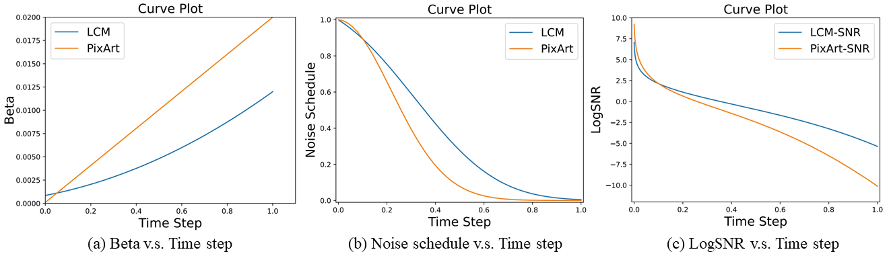
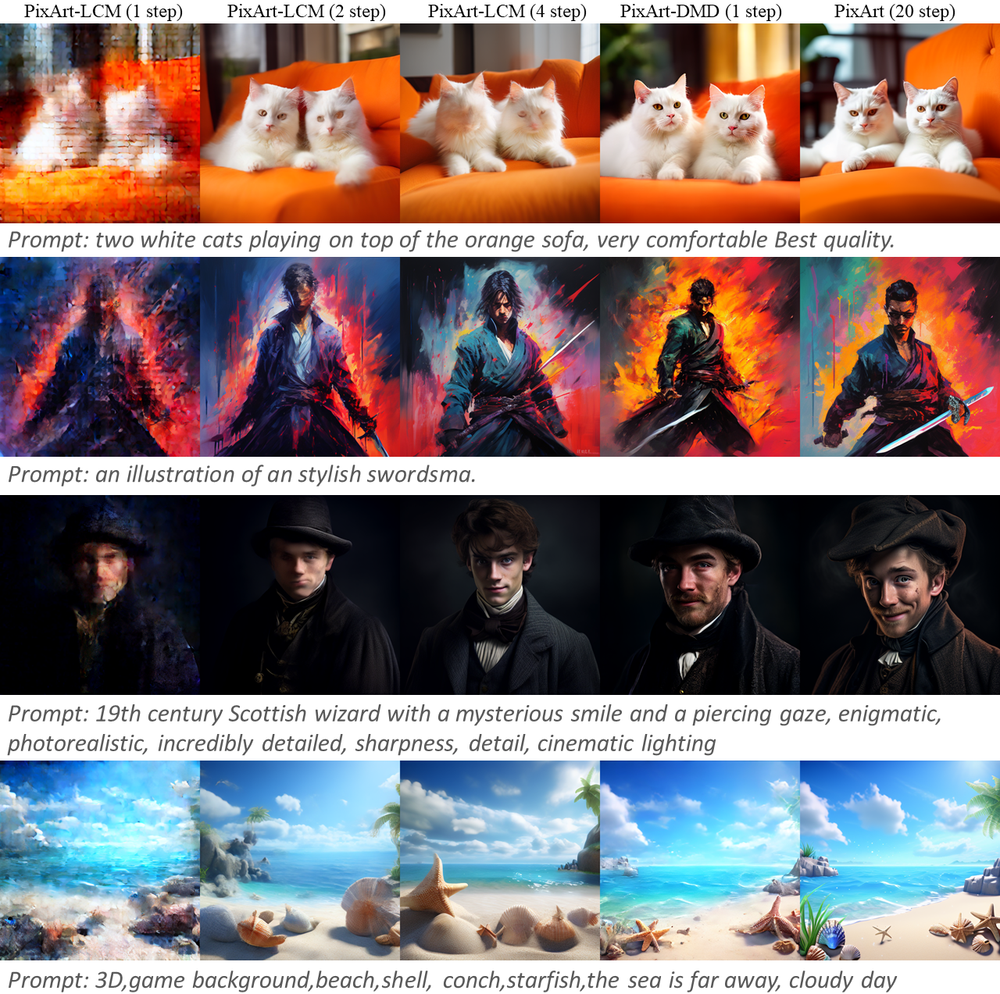

## Summary

**We combine [PixArt-α](https://github.com/PixArt-alpha/PixArt-alpha) and [DMD](https://arxiv.org/abs/2311.18828)
to achieve one step image generation. This document will guide you how to train and test.**



> [!IMPORTANT]  
> Due to the difference between the DiT & Stable Diffusion,
> 
> We find that the setting of the `start timestep` of the student model is very important for DMD training.

refer to PixArt-Sigma paper's Supplementary for more details: https://arxiv.org/abs/2403.04692

---
## How to Train

### 1. Environment
Refer to the PixArt-Sigma Environment [Here](https://github.com/PixArt-alpha/PixArt-sigma/tree/d5adc756dd6a8b64f1f0aaa1d266e90949e873c0?tab=readme-ov-file#-dependencies-and-installation).
To use FSDP, you need to make sure:
- [PyTorch >= 2.0.1+cu11.7](https://pytorch.org/)

### 2. Data preparation (Image-Noise pairs)

#### Generate image-noise pairs
```bash
python tools/generate_dmd_data_noise_pairs.py  \
        --pipeline_load_from=PixArt-alpha/PixArt-XL-2-512x512 \
        --model_path=PixArt-alpha/PixArt-XL-2-512x512 \
        --save_img # (optinal)
```

#### Extract features in advance (Ignore if you already have)
```bash
python tools/extract_features.py --run_t5_feature_extract \
                                 --t5_models_dir=PixArt-alpha/PixArt-XL-2-512x512 \
                                 --t5_save_root=pixart-sigma-toy-dataset/InternData \
                                 --caption_label=prompt \
                                 --t5_json_path=pixart-sigma-toy-dataset/InternData/data_info.json
```

### 3. 🔥 Run
```bash
bash train_scripts/train_dmd.sh
```

---
## How to Test
### PixArt-DMD Demo
```bash
pip install git+https://github.com/huggingface/diffusers

# PixArt-Sigma One step Sampler(DMD)
DEMO_PORT=12345 python app/app_pixart_dmd.py
```
Let's have a look at a simple example using the `http://your-server-ip:12345`.

---
## Samples


