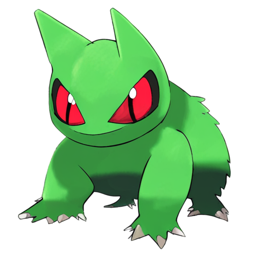

## Summary

**We adapt from the LoRA training code from [PixArt-α](https://github.com/PixArt-alpha/PixArt-alpha) 
to achieve Transformer-LoRA fine-tuning. This document will guide you how to train and test.**

> [!IMPORTANT]  
> Somehow due to the implementation of `diffusers` and `transformers`,
> LoRA training for `transformers` can only be done in FP32.
> 
> We welcome everyone to help for solving this issue.

## How to Train
### 🔥 Run
```bahs
bash train_scripts/train_pixart_lora.sh
```

Details👇:

```bash
pip install -U peft

dataset_id=svjack/pokemon-blip-captions-en-zh
model_id=PixArt-alpha/PixArt-XL-2-512x512

accelerate launch --num_processes=1 --main_process_port=36667  train_scripts/train_pixart_lora_hf.py \
  --mixed_precision="fp16" \
  --pretrained_model_name_or_path=$model_id \
  --dataset_name=$dataset_id \
  --caption_column="text" \
  --resolution=512 \
  --random_flip \
  --train_batch_size=16 \
  --num_train_epochs=80 \
  --checkpointing_steps=1000 \
  --learning_rate=1e-05 \
  --lr_scheduler="constant" \
  --lr_warmup_steps=0 \
  --seed=42 \
  --output_dir="output/pixart-pokemon-model" \
  --validation_prompt="cute dragon creature" \
  --report_to="tensorboard" \
  --gradient_checkpointing \
  --checkpoints_total_limit=10 \
  --validation_epochs=5 \
  --max_token_length=120 \    # chang to 300 for Sigma
  --rank=16
```

## How to Test

```python
import torch
from diffusers import PixArtAlphaPipeline, Transformer2DModel
from peft import PeftModel

device = torch.device("cuda:0" if torch.cuda.is_available() else "cpu")

# You can replace the checkpoint id with "PixArt-alpha/PixArt-XL-2-1024-MS" too.
MODEL_ID = "PixArt-alpha/PixArt-XL-2-512x512"

# LoRA model
transformer = Transformer2DModel.from_pretrained(MODEL_ID, subfolder="transformer", torch_dtype=torch.float16)
transformer = PeftModel.from_pretrained(transformer, "Your-LoRA-Model-Path")

# Pipeline
pipe = PixArtAlphaPipeline.from_pretrained(MODEL_ID, transformer=transformer, torch_dtype=torch.float16)
del transformer

pipe.to(device)

prompt = "a drawing of a green pokemon with red eyes"
image = pipe(prompt).images[0]
image.save("./pokemon_with_red_eyes.png")
```

---
## Samples
